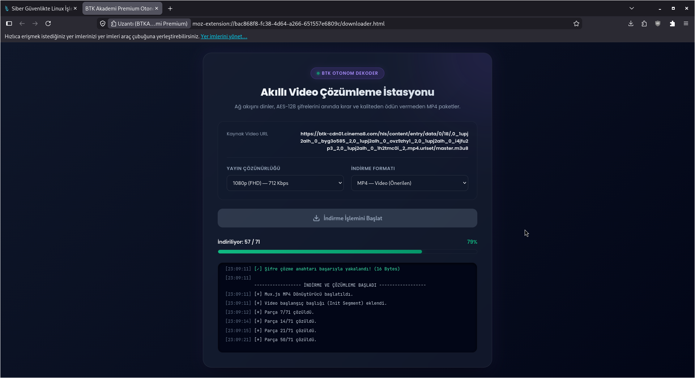

<a id="readme-top"></a>

<h1 align="center">BTKAkademi Premium <sup>(BETA)</sup></h1>

<p align="center">
  <b>Sınırsız Video Hızlandırıcı & Otonom AES-128 Medya İndirici Tarayıcı Eklentisi</b>
</p>

<p align="center">
  <a href="#-türkçe">🇹🇷 Türkçe</a> •
  <a href="#-english">🇬🇧 English</a>
</p>

<p align="center">
  
  
  
  
</p>

---

## Preview / Önizleme

<p align="center">
  
</p>

---

## 🇹🇷 Türkçe

### 🇹🇷 BTKAkademi Premium Nedir?

**BTKAkademi Premium**, BTK Akademi altyapısında kullanılan **Cinema8** video sistemindeki kısıtlamaları kaldıran, **yerel çalışan** ve **gizlilik odaklı** gelişmiş bir tarayıcı eklentisidir.

Sisteminizin izin verdiği ölçüde videoları sınırsızca hızlandırmanıza, videoları tek tıkla tamamlamanıza ve arka planda AES-128 ile şifrelenmiş ham video akışlarını (HLS/m3u8) çözerek bilgisayarınıza indirmenize olanak tanır.

---

### 🚀 Özellikler

- ⚡ **Sınırsız Hız Kontrolü** Tarayıcı sınırlarına takılmadan video hızını dilediğiniz gibi artırın (1x, 2x, 4x, 8x, 16x ve arası).
- 🔒 **Otonom AES-128 Şifre Çözücü** Şifreli video segmentlerini WebCrypto API kullanarak yerel olarak çözer ve birleştirir.
- 📦 **Çoklu Format Desteği** İndirilen medyaları isteğinize göre **MP4** (Önerilen), **TS** (Ham Akış) veya **WAV** (Sadece Ses) olarak kaydedin.
- 🏁 **Hızlı Bitir (Quick Complete)** İzlediğiniz dersi tek tıkla veya kısayolla anında %100 tamamlandı olarak işaretleyin.
- 📸 **Gelişmiş Ekran Görüntüsü** HTML5 Canvas üzerinden veya alternatif olarak doğrudan videonun o anki karesini yakalayıp kaydedin.
- 🎹 **Özelleştirilebilir Kısayollar** Hızlandırma, yavaşlatma, tamamlama ve ekran görüntüsü işlemlerini klavyenizden yönetin.

---

### 🧠 Teknoloji Stack

<p align="center">
  
</p>
<p align="center"><i>Ek olarak akış birleştirme için <b>Mux.js</b> ve şifre çözme için yerel <b>WebCrypto API</b> kullanılmıştır.</i></p>

---

### ⚙️ Kurulum (Geliştirici Modu)

Eklentiyi tarayıcınıza yerel olarak kurmak için:

1. Bu depoyu klonlayın veya ZIP olarak indirin:
   ```bash
   git clone https://github.com/KaganAk71/BTKAkademi_Premium.git
2. Tarayıcınızın eklenti yönetimi sayfasına gidin:
* **Chrome / Edge / Brave:** `chrome://extensions/`
* **Firefox:** `about:debugging#/runtime/this-firefox`


3. Sağ üstteki **"Geliştirici Modu" (Developer Mode)** seçeneğini aktif edin.
4. **"Paketlenmemiş öğe yükle" (Load unpacked)** butonuna tıklayın ve bu klasörü seçin. *(Firefox için manifest.json dosyasını seçerek geçici eklenti olarak yükleyebilirsiniz).*

---

### 🧪 Kullanım

1️⃣ BTK Akademi üzerinden bir video ders sayfası açın.

2️⃣ Eklenti arka planda video akışını (`master.m3u8`) otomatik olarak yakalayacaktır.

3️⃣ Açılır menüden (Popup) video hızını ayarlayabilir veya **Hızlı Bitir** butonunu kullanabilirsiniz.

4️⃣ **İndiriciyi Aç** butonuna tıklayarak açılan şık terminal arayüzünden istediğiniz kaliteyi ve formatı seçip indirmeyi başlatabilirsiniz. 🔥

---

## 🇬🇧 English

### 🇬🇧 What is BTKAkademi Premium?

**BTKAkademi Premium** is an advanced, privacy-focused browser extension designed to bypass limitations on the **Cinema8** video player used by the BTK Akademi platform.

It allows you to increase video playback speed without restrictions, instantly mark videos as completed, and autonomously decrypt AES-128 encrypted HLS streams (m3u8) directly within your browser to download them locally.

---

### 🚀 Features

* ⚡ **Infinite Speed Control** Break through default browser player limits and scale playback speed up to 16x or more.
* 🔒 **Autonomous AES-128 Decryptor** Decrypts encrypted video chunks locally on the fly using the browser's native WebCrypto API.
* 📦 **Multiple Output Formats** Export your downloaded media as **MP4** (Recommended Video), **TS** (Raw Stream), or **WAV** (Audio Only).
* 🏁 **Quick Complete** Mark the active lecture/video as 100% completed instantly with a single click or hotkey.
* 📸 **Video Frame Screenshot** Capture and download high-quality screenshots directly from the HTML5 Canvas player.
* 🎹 **Customizable Hotkeys** Manage speed adjustments, completion, and screenshots seamlessly using keyboard shortcuts.

---

### ⚙️ Installation (Developer Mode)

To install the extension locally on your browser:

1. Clone or download this repository:
```bash
git clone https://github.com/KaganAk71/BTKAkademi_Premium.git
```


2. Navigate to your browser's extensions page:
* **Chrome / Edge / Brave:** `chrome://extensions/`
* **Firefox:** `about:debugging#/runtime/this-firefox`


3. Enable **Developer Mode** in the top right corner.
4. Click **Load unpacked** and select this project directory.

---

## 🗺 Roadmap

* [x] Core Extension Architecture
* [x] AES-128 Decryption Engine (WebCrypto)
* [x] Multi-Format Remuxer (MP4/TS/WAV via Mux.js)
* [x] Speed Injector & Custom Hotkeys
* [x] Quick Complete Integration
* [ ] Cloud Sync for Settings
* [ ] Auto-Skip Quizzes
* [x] Turkish Support
* [x] English Support

---

## Star History

---

## 🤝 Contributing / Katkı

Pull request, issue ve fikirler memnuniyetle karşılanır 🚀

Contributions, issues, and feature requests are welcome!

---

## 💻 Developer

**KağanAk** 🔗 [https://github.com/KaganAk71](https://github.com/KaganAk71)  
*Biz Türk Yazılımcılarıyız 🇹🇷💻* *We are Turkish Coders 🇹🇷💻*

Deneyap Atölyelerinde kurulduk ve şimdi burada projelerimizi geliştiriyoruz.  
Sizlerin desteğiyle daha da iyisini yapacağız.

We were founded in the Deneyap Workshops, and we are now developing our projects here.  
With your support, we will become even better.

**🔥 Made with passion by Turkish Coders** *Your Code. Your Freedom.*

-----

### ❤️ Destek / Support

Eğer bu projeyi beğendiyseniz ve akıllı tahtadaki dertlerinizi çözdüyse sağ üstten yıldız (`Star ⭐️`) vererek destek olabilirsiniz\! Desteğiniz bizim için çok önemli.
If this project saved your day, please consider giving it a `Star ⭐️` on GitHub to show your support\!